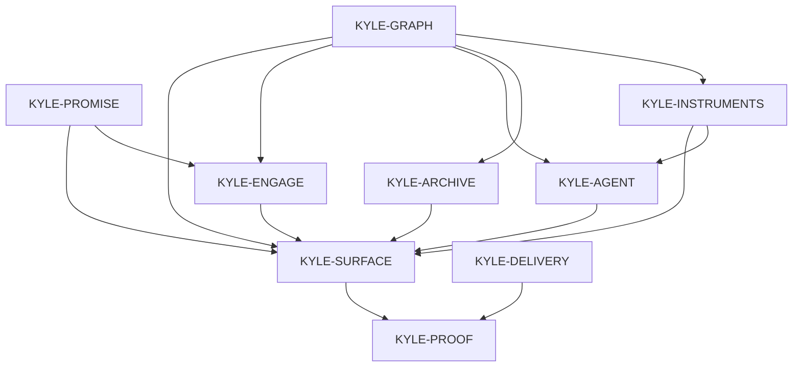

# KYLE identity graph

The destination is [`vision.md`](vision.md). This graph records durable
identities, their fate, hard prerequisites, and falsifiable completion oracles
for the `kylet.se` proof surface. It is not a roadmap, work queue,
implementation inventory, current status report, or second product destination.
Cite the `KYLE-*` IDs below. Fate is `live`, `dead`, or `rename-to:<ID>`. One
colloquial name has one fate.

## Authority boundary

- This repository owns the static portfolio surface, evidence projections,
  curated history, Rust live API, agent persona and tools, engagement journey,
  and product acceptance.
- GitHub and npm own their external facts. The Sylphx AI Gateway owns inference.
  Sylphx Platform owns generic build, artifact, deployment, routing, secret, and
  runtime infrastructure. Unavailability at one of those boundaries does not
  authorize a repo-local substitute or fabricated success.
- Source code and executable contracts own interface behavior. This graph owns
  product identity decomposition, fate, and oracles only.

## Graph

The table is the graph. The Mermaid picture names the same IDs and edges.

`KYLE-DELIVERY` is an independent prerequisite of the terminal proof. Product
delivery mechanics can be established without pretending the customer journey
is live; conversely, a reachable surface cannot bypass exact delivery identity.

## Identity registry

| ID | Identity | Fate | Depends on | Done when |
| --- | --- | --- | --- | --- |
| `KYLE-PROMISE` | Present identity and decision frame | live | — | A human or external agent reaching the primary static surface can accurately state that Kyle builds infrastructure AI agents run on, identify the intended hiring, partnership, OSS-adoption, collaboration, or craft decision, and reach evidence without first using chat. Company and historical material supports this person-level promise rather than becoming an equal product or a competing identity. |
| `KYLE-GRAPH` | One current evidence graph | live | — | One product-owned semantic graph connects current work, capabilities, repositories, packages, adoption, activity, companies, and named claims for both human and machine projections. Each changing fact names its external authority and observation time; current facts, curated history, and unavailable values remain distinct. A parallel current-work catalog, frozen number in persona or copy, unexplained zero, or UI-only fact that can contradict the graph fails the node. |
| `KYLE-INSTRUMENTS` | Honest live evidence instruments | live | `KYLE-GRAPH` | Stats, activity, project, repository, package-download, and structured-claim surfaces obtain changing facts from the named authority and expose provenance, observation time, and freshness consistently to humans and agents. A failed current read may serve only a previously verified, time-labelled stale value; without one it is unavailable. Cached or baked data, an empty provider response, route reachability, `/healthz`, or a successful fixture cannot be called live, and unsupported package identities cannot silently understate adoption. |
| `KYLE-ARCHIVE` | Compressed shipped-era proof | live | `KYLE-GRAPH` | Historical games, social products, portals, enterprise work, and company eras remain inspectable with attributed media, outcomes, and real outlinks, while self-attested or time-bounded claims are visibly distinct from live GitHub or npm facts. The archive is secondary to present AI-infrastructure proof, uses the graph's vocabulary, and does not create another landing journey, content authority, or equal-weight company portal. |
| `KYLE-AGENT` | Grounded portfolio representative | live | `KYLE-GRAPH`, `KYLE-INSTRUMENTS` | The sole agent stays within Kyle's public work and fit, uses the product tools before quoting changing facts, and produces a useful answer whose cited numbers agree with the current instrument observations. Secrets remain server-side, tool or Gateway failures cannot fall through to memory or a generic response, and unavailable credentials or upstream failures make the UI absent or explicitly unavailable without broken response theatre. Readiness or health proves only configuration reachability; live completion requires an actual production tool call and usable terminal answer, plus a failure probe that demonstrates fail-closed behavior. |
| `KYLE-ENGAGE` | One visitor-owned next action | live | `KYLE-PROMISE`, `KYLE-GRAPH` | A visitor can contact, hire, partner, inspect, install, star, or contribute through one clear engagement system and real destination links. Agent-assisted email ends in a visitor-owned send, while direct email and relevant external links remain usable when dynamic evidence or chat is unavailable. No account, multi-field form, autonomous outreach, lead sale, or shadow CRM becomes a second conversion product. |
| `KYLE-SURFACE` | Integrated human and machine proof surface | live | `KYLE-PROMISE`, `KYLE-GRAPH`, `KYLE-INSTRUMENTS`, `KYLE-ARCHIVE`, `KYLE-AGENT`, `KYLE-ENGAGE` | One domain and narrative spine compose Promise, Evidence, Agent, and Engage for a fast human skim, deeper inspection, and read-only external-agent retrieval. Static content remains useful before dynamic data or inference; live, stale, curated, and unavailable states are perceivable; the archive stays secondary; and no terminal, resume, blog, company portal, exhaustive repo dump, or second API/content authority competes with the proof loop. |
| `KYLE-DELIVERY` | Exact product delivery acceptance | live | — | Every first-party required check for the exact candidate SHA runs on the owned `sylphx-linux-standard` profile with no GitHub-hosted, generic self-hosted, dynamic, or repo-specific fallback. The accepted source, check run, immutable web and API artifacts, desired production revision, and observed production revision reconcile to the same identity before product probes run. Source, candidate, landed, released, artifact, deployed, and live states remain distinct; a green check, cached export, preview, queued job, mutable tag, route response, `/healthz`, `/chat/ready`, commit SHA, or deploy light alone cannot close the node. |
| `KYLE-PROOF` | Finished evidence-backed decision journey | live | `KYLE-SURFACE`, `KYLE-DELIVERY` | At one exact production artifact identity on `kylet.se`, a representative visitor can state the promise, verify a current claim against its named authority, distinguish live evidence from stale or curated evidence, inspect a relevant current-work or archive path, receive a grounded tool-using agent answer, and open the intended engagement route. The same promise and evidence are retrievable through the machine surface, and a separate unavailable-dependency observation proves fail-closed instruments and agent behavior while direct engagement remains usable. Source, CI, health, cached artifacts, preview reachability, or deployment state cannot substitute for this live customer observation. |

## Evidence boundaries

| Layer | Establishes | Does not establish |
| --- | --- | --- |
| Source | The exact candidate content, contracts, workflow selectors, and tests | A passing check, built artifact, deployment, or customer outcome |
| Check | The declared validations ran for the exact source on the required owned runner | The immutable artifact that was deployed or any production behavior |
| Artifact and deploy | Exact immutable web/API artifacts were produced and the production owner observed that revision | Fresh external evidence, a usable agent answer, or a completed visitor decision |
| Live | The named postcondition was observed through the exact production identity, including provenance/freshness and failure behavior | Future availability or facts outside the observed scope and time |

## Reading rules

1. `Depends on` is a hard edge, not preferred sequence. Independent nodes may
   proceed in parallel when their write and effect sets do not collide.
2. `Fate` is `live`, `dead`, or `rename-to:<ID>`. Writing a fate and executing
   the named object are separate write/effect sets.
3. `Done when` is a destination oracle, not a statement about this checkout,
   an open pull request, CI, or production.
4. Cached, baked, stale, curated, and live evidence are distinct. A labelled
   fallback may preserve usefulness but cannot close a live clause.
5. Health and readiness endpoints prove only their named narrow condition. A
   live instrument requires current authority readback; a live agent requires a
   grounded terminal response; the finished product requires the visitor
   journey at an exact deployed identity.
6. The owned-runner hard cut is part of `KYLE-DELIVERY`. External runner or
   Platform unavailability blocks only the affected check or delivery claim and
   never authorizes a fallback selector or fabricated proof.
7. Current work, PR collisions, checks, deploy state, and live incidents belong
   to the forge and their runtime owners, not this graph.
